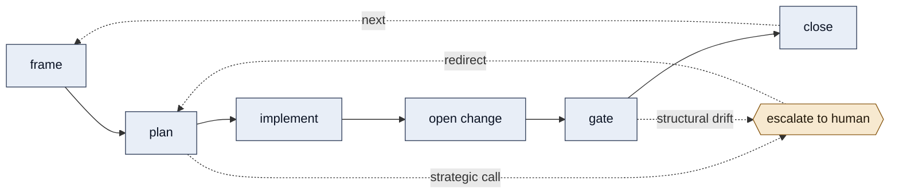
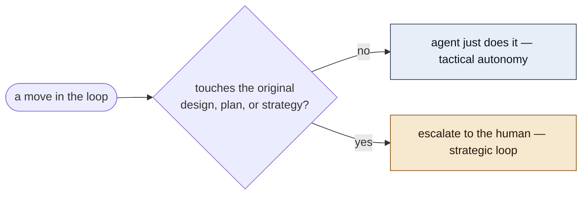

# keelson

> Port a disciplined, issue-driven agentic flow into **any repo**, against **any tracker**.

keelson is a single [Agent Skill](https://www.agensi.io/learn/agent-skills-open-standard) — the **establisher** — that interviews you and writes a tracker-agnostic operating model into your repo: a questionnaire-organized `AGENTS.md` plus a *selectable* lifecycle skill-pack.

It distills the flow a production repo uses to let AI agents ship safely:



**Tactical autonomy** — the agent just does the mechanical moves (claim the issue, branch, code + doc + test, open the change, move status). **Strategic human loop** — it escalates the moment a move touches the original design, plan, or strategy. That balance is the whole point: momentum on the mechanical, a human gate on the consequential.



It's **provider-neutral**. The skills name actions — *"create the issue", "open the change", "set status to `<column>`"* — and your agent runs whatever your tracker uses: GitHub, GitLab, Jira, Linear, or anything with an API/CLI/MCP. The only repo-specific values are filled from your interview answers.

## What you get

The establisher writes two things into your repo:

1. **`AGENTS.md`** — the substrate every skill defers to: your vocabulary, branch/change rules, status columns, the InnoVestrum engineering standards, and the chosen tracker's traps folded in under *Tracker notes*.
2. **A lifecycle pack** — the ideas you pick (below), written as your repo's own skills in plain language.

## Install

### Claude Code (marketplace plugin)

```sh
/plugin marketplace add innovestrum/keelson
/plugin install keelson
```

Then run `/keelson:establish`.

### Codex / any SKILL.md-aware agent (Agent Skill)

The skill is discovered under [`.agents/skills/`](https://developers.openai.com/codex/skills). Vendor it once at user level so it's available in every repo:

```sh
git clone https://github.com/innovestrum/keelson
ln -s "$PWD/keelson/skills/establish" ~/.agents/skills/establish   # Codex follows symlinks
```

Then run `$establish` (or just ask: *"establish the agentic workflow"*). The same path works for Gemini CLI, Copilot, Cursor, and other SKILL.md adopters.

## Use

Run the establisher and answer the interview — one short round per idea. It captures your conventions, then writes `AGENTS.md` and the skills you selected. **Read the new `AGENTS.md` first**; it's the briefing everything else defers to.

## The 16 ideas (selectable)

| | Core loop *(default on)* | Discipline *(default on)* | Milestone & gates *(by repo shape)* |
|---|---|---|---|
| | `frame-the-change` | `respond-to-uncertainty` | `close-a-milestone` |
| | `pick-next-work` | `carve-out-followup` | `review-gate` |
| | `plan-the-work` | `check-prior-art` | `source-sync-gate` |
| | `implement-the-change` | `automate-or-runbook` | `parity-gate` |
| | `open-the-change` | | `sync-docs` |
| | `track-status` | | `update-source-of-truth` |

A backend-only repo with one deploy target might adopt the first ten plus `sync-docs`; a multi-platform app with a design source adopts the gates too. Pick what fits.

## Layout

```
keelson/
├── skills/establish/              the one skill — fully self-contained
│   ├── SKILL.md                   the establisher (interview → fill → write)
│   ├── agents/openai.yaml         Codex metadata
│   ├── references/tracker-notes.md per-tracker traps the establisher folds in
│   └── templates/
│       ├── AGENTS.client.md       the AGENTS.md substrate it writes
│       └── lifecycle/*.md         the 16 selectable skill templates
├── .agents/skills/establish  →    symlink to skills/establish (Codex discovery)
├── .claude-plugin/                Claude marketplace + plugin manifests
└── AGENTS.md  README.md  LICENSE
```

Everything the skill needs at runtime lives **inside `skills/establish/`** — a plugin ships the skill folder, so nothing it reads may sit at the repo root.

## The golden rule

Every file here, and every file the establisher writes, obeys it:

> **Never tell the agent how to do what it already knows.** Write only **gaps**, **gotchas**, and **pointers**. Cut generic CLI/API syntax, config formats, and obvious procedure. A senior engineer's terse handover note, not a tutorial.

That rule, and the engineering standards keelson carries into client repos, come from [innovestrum/agent-skills](https://github.com/innovestrum/agent-skills).

## Trackers

GitHub, GitLab, Jira, and Linear ship with their non-obvious traps and bindings in [`skills/establish/references/tracker-notes.md`](skills/establish/references/tracker-notes.md); anything else with an API/CLI/MCP is handled by the *custom* path (capture how status moves, how a child links to a parent, where changes live, and the endpoint).

## License

[MIT](LICENSE) © InnoVestrum
